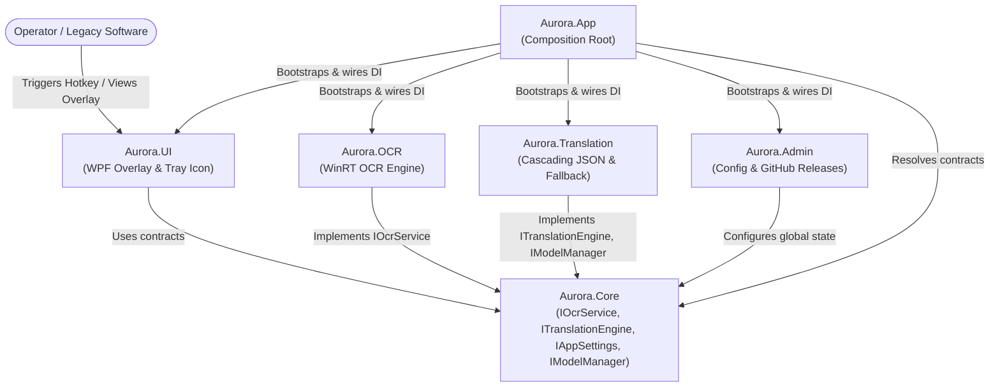
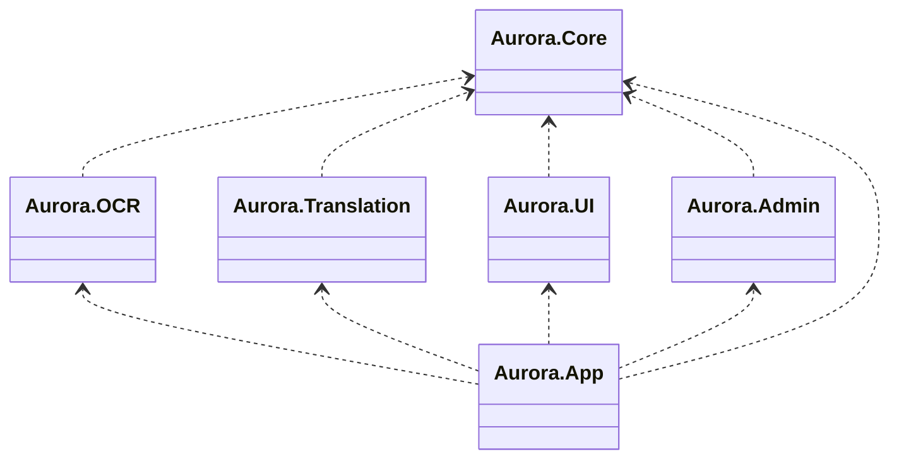

# System Architecture — Codename Aurora

> **Pattern:** Modular Monolith (.NET 10)  
> **References:** Kamil Grzybek (Modular Monolith Architecture), Sam Newman (Monolith to Microservices).

---

## 1. Guiding Principles

1. **Unidirectionality:** All dependencies converge exclusively toward the `Core` module.
2. **Module Isolation:** No operational module (`OCR`, `Translation`, `UI`, `Admin`) may directly reference another horizontal module.
3. **Design by Contract:** All cross-module communication happens exclusively through abstract interfaces defined in `Aurora.Core`.

---

## 2. Component Diagram

---

## 3. Package / Dependency Diagram

Compilation-time dependencies between .NET projects. Arrows point toward the depended-on project.

> **Rule:** No horizontal arrows are allowed. Any dependency not pointing to `Aurora.Core` is a build-breaking architectural violation enforced by `Aurora.Tests.Architecture`.

