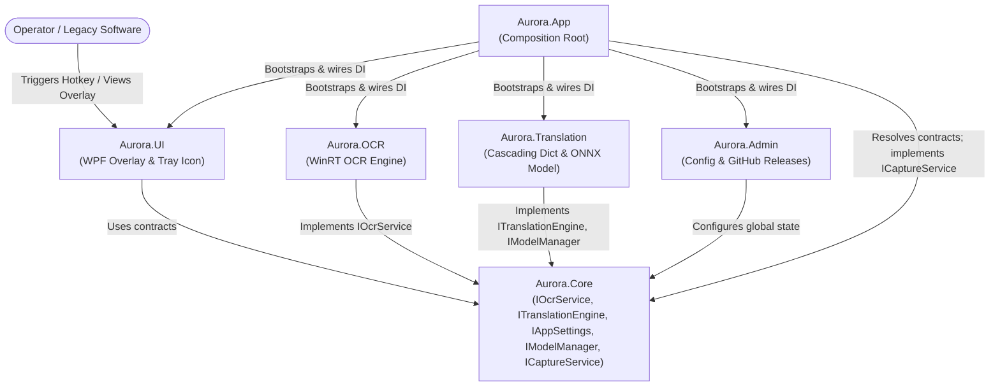
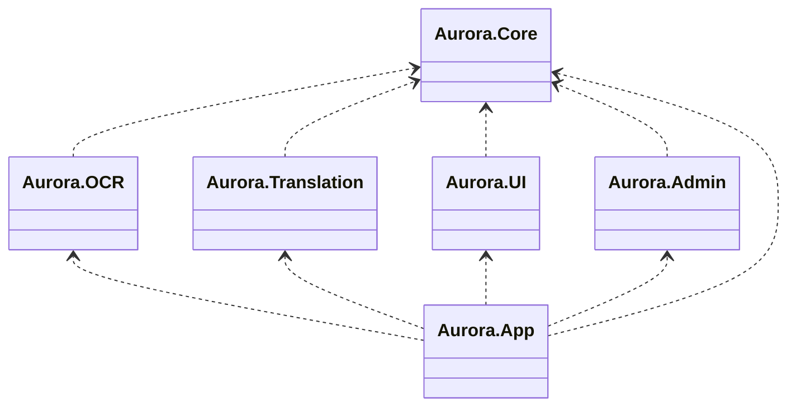

# System Architecture — Codename Aurora

> **Pattern:** Modular Monolith (.NET 10)  
> **References:** Kamil Grzybek (Modular Monolith Architecture), Sam Newman (Monolith to Microservices).

---

## 1. Guiding Principles

1. **Unidirectionality:** All dependencies converge exclusively toward the `Core` module.
2. **Module Isolation:** No operational module (`OCR`, `Translation`, `UI`, `Admin`) may directly reference another horizontal module.
3. **Design by Contract:** All cross-module communication happens exclusively through abstract interfaces defined in `Aurora.Core`.

---

## 2. Component Diagram

---

## 3. Package / Dependency Diagram

Compilation-time dependencies between .NET projects. Arrows point toward the depended-on project.

> **Rule:** No horizontal arrows are allowed. Any dependency not pointing to `Aurora.Core` is a build-breaking architectural violation enforced by `Aurora.Tests.Architecture`.

---

## 4. Isolation Rules

Enforced by NetArchTest in `Aurora.Tests.Architecture`. `Aurora.App` is the sole exception (composition root).

| Module | Must NOT reference |
|---|---|
| `Aurora.OCR` | `Aurora.Translation`, `Aurora.UI`, `Aurora.Admin` |
| `Aurora.Translation` | `Aurora.OCR`, `Aurora.UI`, `Aurora.Admin` |
| `Aurora.UI` | `Aurora.OCR`, `Aurora.Translation`, `Aurora.Admin` |
| `Aurora.Admin` | `Aurora.OCR`, `Aurora.Translation`, `Aurora.UI` |
| `Aurora.Core` | any other module |

All cross-module communication uses MediatR notifications defined in `Aurora.Core` — see `specs/adr/ADR-001-event-bus-mediatr.md`.

---

## 5. Decisions

### Global Hotkey
`Aurora.UI` uses Win32 `RegisterHotKey`/`UnregisterHotKey` via P/Invoke. WPF `KeyDown` ruled out (requires focus). On conflict, Aurora logs a warning and falls back to the default combination. All P/Invoke declarations live in `HotkeyManager` inside `Aurora.UI`.

### Translation Cascade
Four-tier cascade in `Aurora.Translation`: (1) `private.json` → (2) `generic.json` → (3) ONNX model → (4) verbatim. Dictionary lookups stop the cascade immediately. Hot-reload via `FileSystemWatcher`. Both paths read from `IAppSettings`. `private.json` is never version-controlled.

### Local ONNX Model
Helsinki-NLP MarianMT via `Microsoft.ML.OnnxRuntime`. ~300 MB per language pair, downloaded on first use to `%APPDATA%\Aurora\models\`. `IModelManager` (in `Aurora.Core`) owns lifecycle: lazy-load on first call, singleton, `IAsyncDisposable`. Only `Aurora.Translation` implements it.

### Auto-Update
Velopack + GitHub Releases. `VelopackApp.Build().Run()` must be the very first call in `Program.Main()`. `Aurora.Admin` owns update-check at startup and publishes `UpdateAvailable`; `Aurora.UI` reacts via tray notification. Velopack NuGet referenced only by `Aurora.Admin`.

### Core Types

`TranslationResult` (defined in `Aurora.Core`): `{ string Text, TranslationSourceLevel SourceLevel }` where `TranslationSourceLevel` is an enum: `Private | Generic | Model | Verbatim`.

### Settings Contract (`IAppSettings`)
Defined in `Aurora.Core.Interfaces`, implemented by `Aurora.Admin.AppSettings`. Reads `%APPDATA%\Aurora\settings.json` via `System.Text.Json` at startup. Read-only interface — no setters. Settings are written exclusively by `Aurora.Admin` via a separate `ISettingsWriter` interface (also in `Aurora.Core`), which serializes the full settings object back to `settings.json`. Changes apply on next restart.

Properties: `SourceLanguage`, `TargetLanguage`, `HotkeyTrigger`, `HotkeyRullo`, `PrivateDictionaryPath`, `GenericDictionaryPath`, `ModelCachePath`, `UpdateChannel`, `OverlayDismissTimeout` (default: 5 s), `OverlayBackgroundColor` (default: `#CC000000`), `OverlayForegroundColor` (default: `#FFFFFFFF`), `HoverDwellThreshold` (default: 300 ms), `RulloSamplingInterval` (default: 500 ms).

### Capture
`ICaptureService` in `Aurora.Core` with a single `CaptureScreen() → byte[]`. Implemented by `CaptureService` in `Aurora.App` (composition root only — no module may own screen capture independently). Returns `Array.Empty<byte>()` when the foreground window belongs to Aurora's own process (prevents overlay self-capture).

### Pipeline
`PipelineExecutor` (internal, `Aurora.App`) deduplications the capture→OCR→translate→publish sequence shared by the hotkey handler and the continuous-mode tick. Both consumers call `ExecuteAsync()` — no copy-paste of the pipeline logic.

### Composition Root
`Aurora.App` is the sole `WinExe` and DI composition root — references all modules, contains no business logic. `Aurora.UI` is a WPF class library (`UseWPF=true`, no `OutputType`). All DI registrations and MediatR handler registrations live in `Aurora.App`. `App.xaml` compiles as `Page` to avoid a competing `Main()`.

### Model Manager
`IModelManager` in `Aurora.Core` with `EnsureLoadedAsync()` (idempotent) + `IAsyncDisposable`. `Aurora.Translation` implements it. Registered as singleton in `Aurora.App`. `IsLoaded` exposed for diagnostics. Formalises the lazy-load strategy for ONNX sessions.
